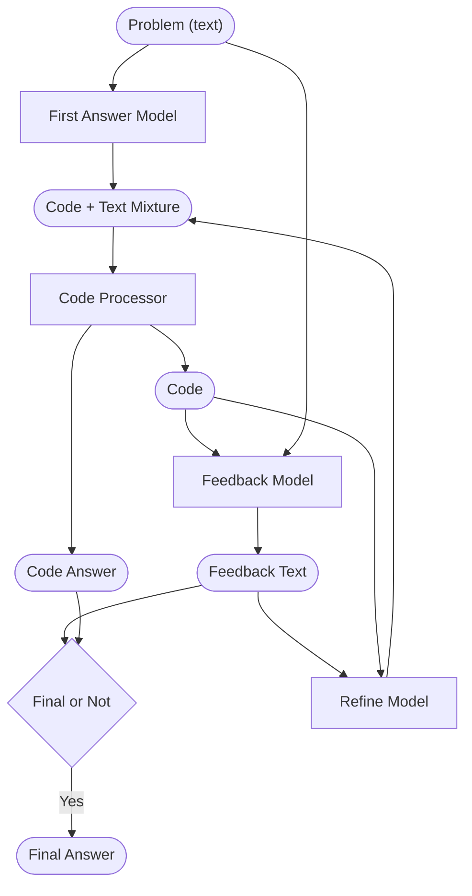

# About
This repository contains our team's code for the Kaggle competition <a href="https://www.kaggle.com/competitions/ai-mathematical-olympiad-prize">AI Mathematical Olympiad - Progress Prize 1</a>. The competition aims to push progress in developing AIs that solve hard math problems such as IMO problems or even conduct math research. It is world-renowned, as it featured a speech by Terence Tao saying its positive impact. 

The Kaggle notebook submitted to the competition can be viewed <a href="https://www.kaggle.com/code/tingjunwang/refine/edit/run/185764007">here</a>.

Below is the workflow of our solution. The input (Problem in round box)
is a math problem stated in natural language, and the output (Final Answer in round box) is a number.  

Notice that there is a loop in this workflow, which is the refinement loop. See the "Code + Text Mixture" round box, the arrow from it to the Code Processor, and the arrow from the Refine Model to it. The loop will keep refining the code until the number of loops reaches a threshold or the feedback model thinks the code is final.

# Competition Result
Our model answered 8 questions correctly out of 50 questions. It was not as good as expected because we suspected that timeout occurred for quite a few questions. Generating an answer using our workflow will need to pass through many LLMs, so it does take a considerable amount of time. We tried to tweak the parameters such as the maximum number of refine loops or number of self-consistency repetitions to reduce the number of LLM calls, but we still did not tweak them well enough to prevent timeout. 

If timeout had not occurred, we expected to get a score of 15 to 25 out of 50, since our work was built on <a href="https://scholar.google.com/citations?user=Hc6MI0QAAAAJ&hl=en">Lewis Tunstall</a>'s notebook prototype and it scored 21.  

In the future, we might change some models to no longer be based on LLMs. For example, we might parse the problem into the LEAN programming language, and our refine model might be trying out different problem-solving trajectories in the LEAN language space, which is just mechanically executing procedures instead of using LLM inference. 
Exploring in the LEAN language space can be done programmatically rather than using the time-consuming LLM inference.

# Old Stuff
To see the notes for past development, please see `readme_old.md`.

# References
The `modeling` directory comes from MATH dataset code.
